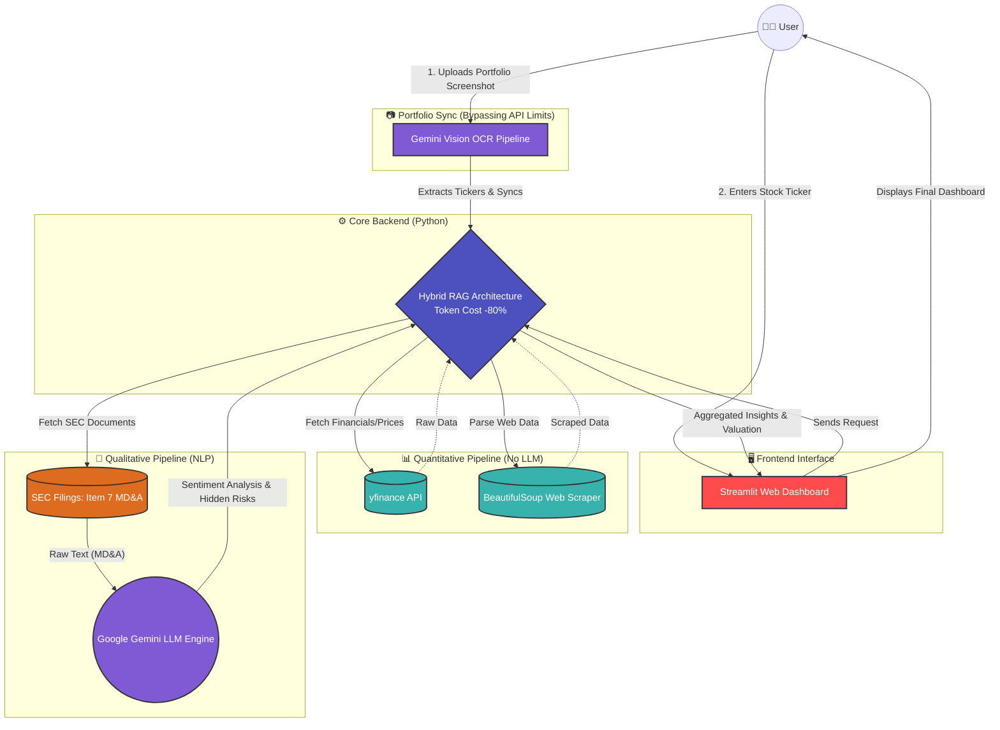

# ATLAS Terminal — All-in-One Financial Analysis Dashboard

A **cost-effective**, institutional-grade financial analysis platform built with Streamlit. Combines **qualitative AI-driven insights** from SEC 10-K filings with **quantitative valuation models** in a single unified workflow.

**Hybrid architecture:** Google Gemini powers qualitative narrative analysis (MD&A, Risk Factors); all numbers—DCF inputs, peer multiples, technical indicators—come from **yfinance** and **yahooquery**, keeping API costs low and numerical accuracy high.

---

## Live Demo

```
streamlit run app.py --server.port 8501
```
Open: [http://localhost:8501](http://localhost:8501)

---

## Seven-Tab Layout

| Tab | Purpose |
|-----|---------|
| **1. 10-K & MD&A Insights** | SEC EDGAR 10-K → Item 7 (MD&A) + Item 1A (Risk Factors) → Gemini streaming analysis. DuPont, Altman Z-Score, red flags, YoY ratios; Piotroski F-Score; sector-specific KPIs; Sankey & Radar charts. Native SEC/DART filing HTML viewer. |
| **2. DCF Valuation** | 5-year 2-stage DCF with Bull/Base/Bear scenarios. Smart defaults from Beta/CAPM. Damodaran sector WACC reference panel. Analyst consensus, FCFF/FCFE bridge, sensitivity table. |
| **3. Industry Comps** | Peer multiples (Forward P/E, EV/EBITDA, P/B) with green/red conditional formatting. Gemini-powered industry outlook (12–18 month macro trends). |
| **4. News Feed** | Real-time Google News RSS feed filtered by company. |
| **5. Markets & FX** | Live FX rates (USD/KRW, GBP/USD, EUR/USD, USD/JPY). S&P 500 sector performance heatmap (XLK, XLV, XLF …). |
| **6. Crypto** | Live prices for 12 major cryptocurrencies (BTC, ETH, SOL, XRP …) with 24h change and market cap. |
| **7. Technical & Risk** | RSI(14), SMA(50/200), Golden/Death Cross signals, 52-week range, support/resistance. Quantitative risk matrix with estimated EPS impact per risk factor. |

---

## Key Features

### AI & Qualitative Analysis (Tab 1)
- **Gemini streaming** for Item 7 (Management Strategy) and Item 1A (Risk Factors) — results appear word-by-word in real time
- **Forensic audit** (Item 3 & 9A) runs automatically alongside Risk Factor analysis
- **Native SEC Filing Viewer**: renders original SEC HTML directly in-app via `streamlit.components.v1.html()` — no redirect, no loss of formatting
- **Filing type selector**: 10-K, 10-Q, 8-K, 20-F, 6-K — backend dynamically fetches the correct form from EDGAR
- **Korean DART direct links** for Korean-listed companies
- **Sector-aware Non-GAAP KPI extraction**: Gemini identifies industry-specific metrics (ARR/NDR for SaaS, Same-Store Sales for Retail, Rule of 40 for Tech)

### Quantitative Analysis (Tab 1 & 2)
- **DuPont decomposition** (3-step ROE: NPM × Asset Turnover × Equity Multiplier)
- **Altman Z-Score** (Safe > 2.99, Grey Zone 1.81–2.99, Distress < 1.81)
- **Piotroski F-Score** (9-point checklist; SEC Item 8 + Gemini for US equities, yahooquery/yfinance globally)
- **Sankey chart**: Income Statement flow (Revenue → COGS → Gross → OpEx → EBIT → Tax/Interest → Net Income)
- **Radar chart**: 5-axis financial health (Profitability, Liquidity, Efficiency, Solvency, Growth)
- **YoY and QoQ ratio changes** with coloured trend indicators
- **Sector-specific metrics**: Tech (Rule of 40, R&D %), Retail (Inventory Turnover), Financials (ROE, ROA)

### DCF & Valuation (Tab 2)
- **Excel-style 5-year DCF**: 3 scenarios (Bull/Base/Bear) with probability-weighted expected return
- **Smart defaults**: WACC from CAPM (Beta), terminal growth 2.5% (Damodaran-style), FCF growth from consensus estimates
- **Damodaran sector WACC reference panel**: Software 8.5%, Retail 7.5%, Hardware 9.0%, Financials 8.0%
- **FCFF/FCFE bridge**: detailed waterfall from EBIT → NOPAT → FCFF and Net Income → FCFE
- **DCF sensitivity table**: 5×5 grid across WACC and terminal growth rate combinations
- **Analyst consensus** embedded next to sliders (target price, recommendation, revenue/earnings growth estimates)

### Data Robustness
- **Primary**: yahooquery for fundamentals + TTM construction
- **Fallback**: yfinance (multi-step: `fast_info` → `info` → balance sheet)
- **TTM fallback**: quarterly sum when annual data is unavailable
- **PyArrow-safe DataFrames**: uniform column types to prevent serialization errors
- **`@st.cache_data` caching**: 2–60 min TTL per function to minimise API calls

### Global Company Search
- Search by name in **any language** (English, Korean, Japanese, etc.) via yahooquery
- Auto-infers market suffix: `.KS`/`.KQ` (Korea), `.T` (Japan), `.L` (UK)
- Last selected company **persists across page refresh** via local `.app_prefs.json`

---

## Architecture: Hybrid AI + Quantitative Pipeline



**Design principle:** LLM for text only; Python for numbers. This eliminates hallucination risk on financial figures and keeps API costs to a single Gemini call per session.

---

## Modular Code Architecture (v3.0)

The codebase was refactored from a 3,909-line monolith into **28 focused modules**, each under 300 lines, following strict Separation of Concerns.

```
app.py                      # Thin orchestrator (~118 lines)
│
├── config/
│   ├── constants.py        # Company lists, sector maps, row maps, Damodaran baselines
│   └── theme.py            # Soft Navy CSS theme + header HTML
│
├── utils/
│   ├── prefs.py            # Local preference persistence (.app_prefs.json)
│   ├── formatting.py       # _safe_float, _format_shares_display, _na
│   ├── ticker.py           # get_global_ticker, infer_market_from_ticker
│   ├── dcf.py              # excel_style_dcf, dcf_10y_2stage, _damodaran_wacc_for_sector
│   ├── charts.py           # Sankey, Radar (Plotly) builders
│   └── ui_helpers.py       # Analyst consensus panel, DCF sensitivity table
│
├── data/
│   ├── sec_parser.py       # HTML text extraction, Item section finder (regex)
│   ├── sec_fetcher.py      # EDGAR API fetch (CIK lookup, submissions, HTML cache)
│   ├── sec_downloader.py   # 10-K download via sec-edgar-downloader, section extraction
│   ├── financials.py       # yahooquery + yfinance annual data, TTM construction
│   ├── fundamentals.py     # Sector/industry, 5-year trend, DCF inputs
│   ├── valuation.py        # Analyst consensus, DCF smart defaults, FCFF/FCFE
│   ├── ratios.py           # Comps, DuPont/Altman Z, quarterly momentum/ratios
│   ├── scores.py           # Sankey data, radar metrics, Piotroski, sector metrics
│   ├── scores_ai.py        # AI-derived Sankey/Piotroski/Radar from Gemini extraction
│   └── market.py           # Technical indicators, risk matrix, ticker bar, news RSS
│
├── ai/
│   ├── gemini_core.py      # Model init, retry logic, streaming, chunking, forensic audit
│   ├── gemini_sec.py       # SEC financials LLM, Item 7 strategy stream, Item 1A risk stream
│   └── gemini_insights.py  # MDA chunked insights, comparative analysis, industry outlook
│
└── views/
    ├── sidebar.py          # Company search, API keys, market selector
    ├── tab1_quant.py       # Financial health tables & charts
    ├── tab1_ai.py          # Deep-dive AI streaming analysis
    ├── tab1_filings.py     # SEC/DART native filing HTML viewer
    ├── tab2_dcf.py         # DCF valuation & FCFF/FCFE
    ├── tab3_comps.py       # Industry comps & AI outlook
    ├── tab4_news.py        # News RSS feed
    ├── tab5_markets.py     # FX rates & sector heatmap
    ├── tab6_crypto.py      # Cryptocurrency prices
    └── tab7_technical.py   # Technical indicators & risk matrix
```

**Dependency direction (no circular imports):**
```
app.py → views/ → data/ or ai/
utils/ ← importable from anywhere
data/ ↔ ai/ direct imports are forbidden
```

---

## Tech Stack

| Layer | Technology |
|-------|-----------|
| UI Framework | Streamlit |
| AI / LLM | Google Gemini 2.0 Flash (`google-generativeai`) |
| Financial Data | yahooquery (primary), yfinance (fallback) |
| SEC Data | sec-edgar-downloader, EDGAR public REST API |
| HTML Parsing | BeautifulSoup4, lxml |
| Charts | Plotly (Sankey, Scatterpolar Radar, Line) |
| Caching | `@st.cache_data` (2–60 min TTL per function) |

---

## Technical Challenges & Solutions

### Challenge 1 — 429 Resource Exhausted (LLM Token Overflow)

**Problem:** Full 10-K filings (200+ pages) caused Gemini 429 errors and rate limits.

**Solution:** Selective section extraction (Item 7 only → ~80% token reduction), HTML cleansing (BeautifulSoup + regex strips tags/whitespace), smart chunking with head+tail trim, and a 60-second retry decorator.

### Challenge 2 — SEC EDGAR HTML Not Rendering

**Problem:** The filing viewer showed "원본 HTML을 가져오지 못했습니다" because the legacy code used `directory.item` from the index JSON (now deprecated) instead of the submissions API.

**Solution:** Rebuilt the EDGAR fetch chain — `company_tickers.json` → CIK lookup → `submissions/CIK{cik}.json` → `filings.recent.primaryDocument[]` → direct `.htm` download. Added `streamlit.components.v1.html()` for native in-app rendering with an injected CSS reset.

### Challenge 3 — PyArrow Serialization in Streamlit

**Problem:** Mixed-type DataFrame columns (float + string in same column) caused `ArrowInvalid` errors when passing DataFrames through `@st.cache_data`.

**Solution:** Explicitly coerce all display strings before DataFrame construction; keep numeric columns as float, string columns as str throughout the pipeline.

### Challenge 4 — 3,909-line Monolith Maintainability

**Problem:** A single `app.py` containing all business logic, UI rendering, and data fetching became unmanageable and untestable.

**Solution:** Full modular refactoring into 28 files across 5 packages (config, utils, data, ai, views). Dependency graph enforced no circular imports. All cache decorators and session state preserved identically. Each file kept under 300 lines.

---

## Project Origin & Vision

### The Origin — The Walk

The core idea came during a **quiet walk** while reflecting on the fragmentation of traditional equity research: narratives buried in 200-page filings, valuation models in separate spreadsheets, and comp tables scattered across different tools. What analysts need is not more dashboards — but **one seamless workflow** where qualitative AI insights and quantitative valuation models live in the same place, speak the same language, and serve the same decision.

That realisation crystallised into the design you see here: **unified, cost-conscious, and built for the analyst who thinks in both words and numbers.**

### The Vision — Commercialisation

This repository is a **functional MVP** and technical portfolio piece. It proves the concept: hybrid architecture works, 10-K + DCF + comps can coexist in a single interface, and the unit economics (one Gemini call for narrative, free data for the rest) scale sustainably. The modular codebase is production-minded — each module under 300 lines, no circular imports, explicit error handling — and is the foundation on which a commercial product will be built.

**Ultimate goal:** Launch as a **fully commercialised B2C/B2B SaaS** serving retail investors who want institutional-grade structure without complexity, and finance professionals (equity analysts, portfolio managers, corporate development) who want to move from filing → insight → valuation in one flow.

---

## Design Rationale (Interview Notes)

- **Why hybrid (LLM for text, Python for numbers)?**
  LLMs hallucinate financial figures. Separating concerns — Gemini for narrative, yfinance for numbers — gives the best of both: nuanced qualitative analysis with numerically accurate, auditable quantitative data.

- **Why a 5-year 2-stage DCF instead of a simple Gordon Growth model?**
  A single-stage model lets terminal value dominate the result, which overstates value for high-growth companies. The 2-stage model (Stage 1: projected FCF growth; Stage 2: terminal growth) is closer to how institutional DCF models are built and avoids absurd valuations.

- **Why integrate Damodaran's academic baselines?**
  Slider defaults anchored to peer-reviewed data (Damodaran sector WACC, US ERP, 10Y risk-free rate) give users a credible starting point. The reference panel links to his data pages so users can verify and critique the assumptions.

- **Why modular architecture?**
  Single-file Streamlit apps are fast to prototype but impossible to test, maintain, or extend. Separation of concerns — config, utils, data, ai, views — makes each component independently comprehensible, testable, and replaceable without touching the rest of the system.

- **Why yahooquery as primary (not yfinance)?**
  yahooquery's bulk query API returns TTM-constructed financials with cleaner column names. yfinance is kept as a fallback for tickers yahooquery misses and for technical/historical price data.

---

## Requirements

- Python 3.9+
- [Google API Key (Gemini)](https://aistudio.google.com/apikey)
- An email address for SEC EDGAR programmatic access
- All Python dependencies in `requirements.txt`
- Optional: `.env` with `GOOGLE_API_KEY` and `SEC_EDGAR_EMAIL`

---

## How to Run

```bash
# 1. Navigate to project directory
cd "/path/to/your/FQDC Project"

# 2. Activate virtual environment
source venv/bin/activate           # Mac/Linux
# venv\Scripts\Activate.ps1       # Windows PowerShell

# 3. Install dependencies (first time or when requirements change)
pip install -r requirements.txt

# 4. Launch the app
streamlit run app.py --server.port 8501
# or: ./run.sh
```

Open **http://localhost:8501** in your browser.

Set **Google API Key** and **SEC EDGAR Email** in the sidebar. Then search for any company by name (any language) and explore the seven tabs.

---

## Update History (Changelog)

| Date | Update |
|------|--------|
| **2026-03-19** | **Modular refactoring (v3.0) + SEC filing viewer fix:** (1) **Architecture:** 3,909-line `app.py` refactored into 28 focused modules across `config/`, `utils/`, `data/`, `ai/`, `views/`. Each file under 300 lines. Strict unidirectional dependency graph (no circular imports). All `@st.cache_data` TTLs and `st.session_state` keys preserved identically. (2) **SEC Filing Viewer fixed:** Rebuilt EDGAR fetch chain using `submissions/CIK{cik}.json` → `filings.recent.primaryDocument[]` (replaces deprecated `directory.item` lookup). Added filing type `st.selectbox` (10-K, 10-Q, 8-K, 20-F, 6-K) connected to backend dynamically. Native HTML rendered via `streamlit.components.v1.html()` with injected CSS reset. Errors surfaced explicitly with `st.error()`. (3) **DART links** restored for Korean-listed companies. |
| **2026-02-18** | **Market Heatmap & FX charts:** Sector heatmap with 5d/1mo data and per-ticker fallback (weekend/holiday robust). FX Momentum normalized 1Y line chart (GBP/USD, EUR/USD, USD/JPY, KRW). 10-K language toggle (한글/영문) via Gemini translation. plotly/yfinance added to requirements. |
| **2026-02-17** | **DART, prefs, run script:** DART fetch timeout 90s; DART report titles in English (cached). SEC & DART per-category iframe viewer. Last selected company persisted in `.app_prefs.json` (survives page refresh). Single run script `run.sh` at port 8501. |
| **2025-02-15** | **Multi-currency portfolio & FX:** Per-position currency (USD/GBP/EUR/KRW/JPY/CNY), fractional quantity, FX-adjusted returns. Gemini Vision AI screenshot import (extracts ticker, price, currency, quantity). App-wide `get_currency_for_ticker`, `get_fx_rate`, `format_price_with_usd`. |
| **2025-02-14** | **Global company search:** yahooquery `search()` replaces static dropdown. Search by name in any language; filters INDEX/MUTUALFUND; auto-infers .KS/.KQ/.T/.L suffix. |
| **2025-02-13** | **Design Rationale & 10Y DCF:** Design rationale section (undergrad automation mindset, 10Y 2-stage DCF, Damodaran integration). Wall Street Assumptions panel (analyst consensus + Damodaran baselines). Smart DCF defaults from Beta/CAPM. |
| **2025-02-13** | **Robust data & comps redesign:** Multi-step shares/debt/cash fallback (fast_info → info → balance). Top-down sector analysis with `SECTORS` dict and AI Industry Outlook (Gemini). |
| **2025-02-12** | **Hybrid architecture:** Item 7 only to Gemini; yfinance for all numbers. HTML cleansing pipeline (BeautifulSoup + regex). |
| **2025-02-12** | **DuPont, Altman Z, Piotroski, sector KPIs, TTM fallback:** Full quantitative financial health suite. Sector-specific metrics (Tech: Rule of 40; Retail: Inventory Turnover; Financials: ROE/ROA). |
| **2025-02-12** | **Preference persistence:** "Remember API key & email" checkbox; `.app_prefs.json` (gitignored). |
| **2025-01-XX** | **Initial release:** SEC EDGAR 10-K download, Item 7/8 extraction, Gemini analysis, Streamlit UI. |

---

## License and Disclaimer

This project is built for learning, research, and portfolio demonstration. Comply with [SEC EDGAR policy](https://www.sec.gov/os/webmaster-faq#code-support) when accessing SEC data, and with Google's terms of service for the Gemini API. Nothing in this app constitutes investment advice.
