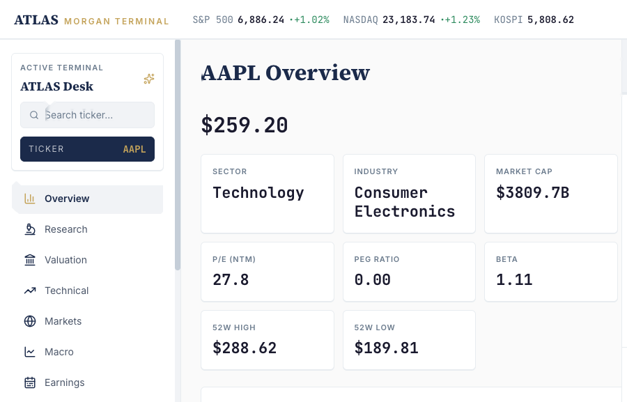
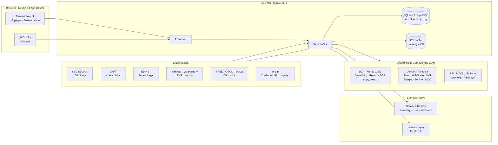
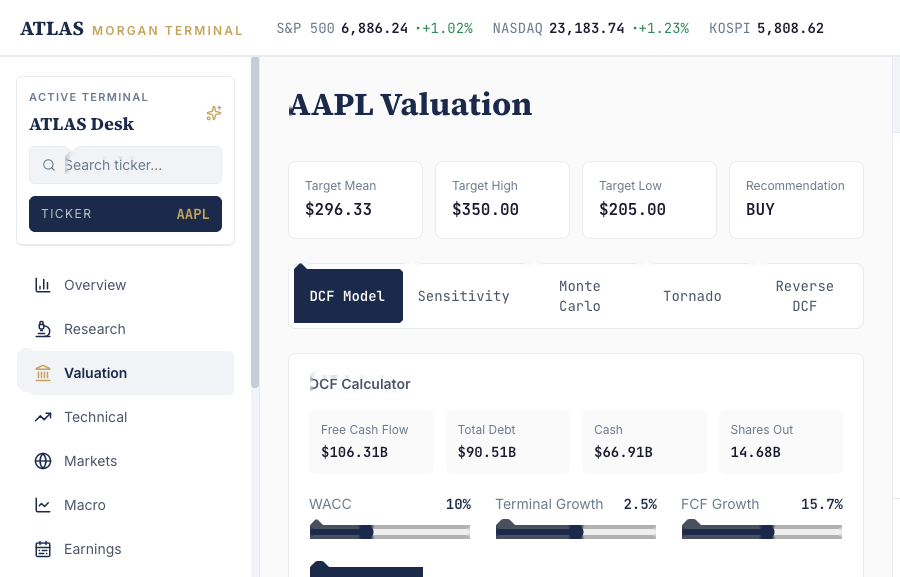
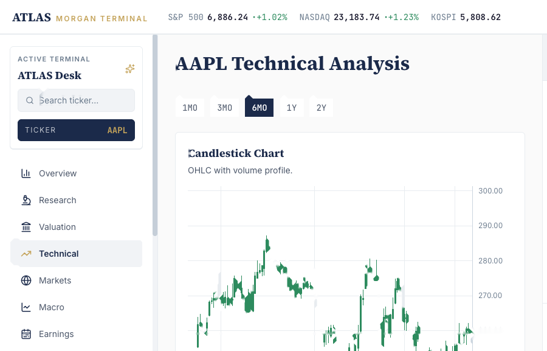
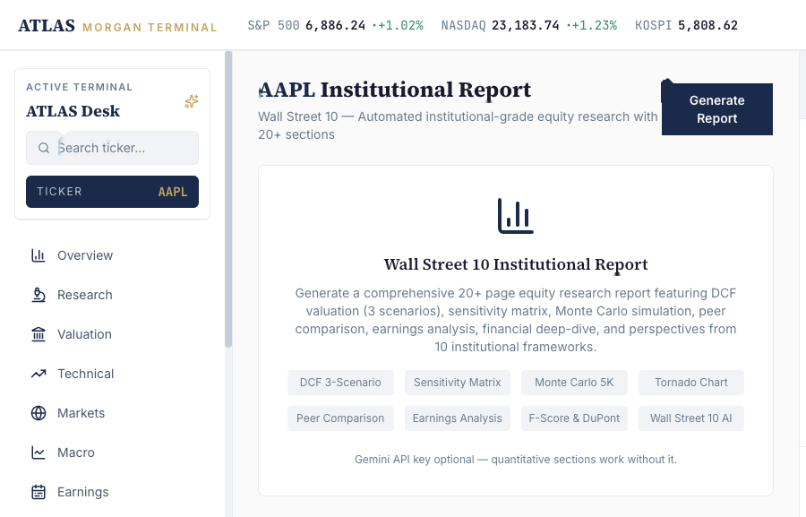

<div align="center">

# ATLAS Terminal

### A Bloomberg-style equity research workbench for retail investors

**Built solo. Full-stack. 22 API routers · 37 services · 13 frontend pages · zero LLM-priced math.**

[](https://github.com/shawnkim1997/All-in-one-Financial-Analysis/actions/workflows/ci.yml)


[**Live walkthrough**](./docs/media/atlas-demo.mp4) · [**Architecture**](#architecture) · [**Why**](#why-this-project)



</div>

---

## The Problem

Retail investors are forced to bounce between 10+ tools — Yahoo Finance, TradingView, SEC EDGAR, DART, FRED, FMP, broker apps, YouTube earnings calls, news scrapers — to do what one Bloomberg seat does in one window. The information asymmetry costs them real money.

**ATLAS Terminal closes that gap as a single desktop-first interface** that fuses market data, fundamental research, valuation, technicals, macro, filings, news, video transcript analysis, and a printable institutional report — without farming financial computation out to an LLM.

---

## Core Principle

> **LLMs handle text. Python handles numbers.**

Every valuation number, every ratio, every Monte Carlo path is computed deterministically in Python with `pandas`, `scipy`, and `numpy`. Gemini is reserved strictly for qualitative work — MD&A summarisation, 10-K risk extraction, transcript summarisation, news translation, copilot dialogue. This separation keeps the math auditable and the token bill in check.

---

## What's New — Video Transcript Workbench

**Just shipped.** A complete pipeline that turns any video into structured research:

1. **Submit** a YouTube URL, direct media URL, or local upload
2. **Extract** — prefer existing subtitles via `yt-dlp`, fall back to local `faster-whisper` STT
3. **Analyse** — Gemini distils summary · keywords · topics · sentiment · intent in one JSON pass
4. **Persist** — SQLite FTS5 (or PostgreSQL `tsvector`) makes every transcript searchable
5. **Translate** — optional Korean translation on demand

Built so an earnings call, a CEO interview, or a sell-side YouTube deep-dive can become a structured note inside the terminal in a single round trip — never leaving the research workflow.

> Drop in a screenshot of the running `/transcripts` page at `docs/media/atlas-transcripts.png` to display it here.
>
> ``

---

## Architecture



Architecture is enforced by two rules:

- **Per-feature fallback chains** — every data domain has an explicit primary→secondary source (`yfinance → yahooquery` for prices, `FMP → yahooquery → yfinance` for historical ratios, `yahooquery → yfinance` for DCF inputs). Failures degrade gracefully, never surface raw exceptions to the UI.
- **One file, one responsibility** — services are capped at ~300 lines, routers stay thin, business logic stays out of UI components.

---

## Product Tour

| Page | What it does |
|------|--------------|
| `/` Overview | Multi-asset (Equity / ETF / Commodity auto-routed) — sector, DuPont, Altman Z, peer comparison, KPI sparklines |
| `/research` | Quant grid — F-Score history, DuPont tree, Sankey income flow, operating-profit waterfall, anomaly chips |
| `/valuation` | 5-tab DCF — 3-scenario, sensitivity matrix, 5,000-path Monte Carlo, tornado, reverse-DCF (scipy `brentq`) |
| `/technical` | Lightweight Charts candlesticks, RSI / MACD / ATR, MAs, Bollinger, Fibonacci, Ichimoku |
| `/macro` | 5-tab macro (FRED · cycle · OECD CLI · Korea · calendar) + growth-vs-inflation quadrant + yield-vs-FX + smart-money panel |
| `/markets` | Statements (yfinance → yahooquery fallback) + sector heatmap (S&P · NASDAQ · KOSPI · FTSE) |
| `/earnings` | EPS beat/miss history, next earnings, quarterly revenue/EPS |
| `/news` | Split-view — Finviz + Google + Yahoo RSS + in-pane iframe reader |
| `/transcripts` | **New.** Video / audio → STT → Gemini summary → FTS5 search |
| `/filings` | Jurisdiction auto-routing — SEC / DART (`.KS` `.KQ`) / EDINET (`.T`), 5-tab + AI summary |
| `/screener` | PE/sector/dividend screener + SMA/RSI/buy-and-hold backtest |
| `/portfolio` | Positions CRUD + VaR / Sharpe / Sortino / MDD + OCR screenshot import + UK CGT planner |
| `/report` | Printable 13-page institutional research PDF |





---

## Stack

- **Frontend** — Next.js 14 App Router · React 18 · TypeScript (strict) · Tailwind (Terminal Noir tokens) · Lightweight Charts · Recharts · `@nivo/sankey` · `@nivo/bar` · Zustand (persisted terminal state)
- **Backend** — FastAPI · Pydantic v2 · `pandas` · `numpy` · `scipy` · `ta` · `aiosqlite` · `asyncpg` · `httpx`
- **Data** — SEC EDGAR · DART · EDINET · FRED · OECD · DBnomics · ECOS · Yahoo Finance · FMP (optional)
- **AI** — Gemini 2.0 Flash (qualitative only) · `faster-whisper` (local STT) · `yt-dlp` (subtitle/audio fetch)
- **Storage** — SQLite by default (FTS5 for transcripts) · PostgreSQL with `tsvector` when `DATABASE_URL` is set
- **Security** — AES-GCM envelope encryption for broker credentials, master key never written to disk
- **CI / Quality** — GitHub Actions · pytest · Playwright route smoke tests · TypeScript strict · per-page e2e

---

## Quick Start

```bash
# Backend
pip install -r requirements.txt
PYTHONPATH="." uvicorn server.main:app --port 8000

# Frontend
cd apps/web && npm install && npm run dev

# Transcripts pipeline prerequisite (macOS)
brew install ffmpeg
```

| Surface | URL |
|---------|-----|
| Frontend | http://localhost:3000 |
| Backend | http://127.0.0.1:8000 |
| API docs | http://127.0.0.1:8000/docs |

```bash
# Verification
pytest tests -q
cd apps/web && npm run typecheck && npm run build && npm run e2e
```

### Feature flags (Phase 6, opt-in)

```bash
NEXT_PUBLIC_FLAG_CALENDAR=true
NEXT_PUBLIC_FLAG_FINANCIALS=true
NEXT_PUBLIC_FLAG_OWNERSHIP=true
NEXT_PUBLIC_FLAG_CORR=true
NEXT_PUBLIC_FLAG_CGT=true
NEXT_PUBLIC_FLAG_REDTEAM=true
```

### Environment

```env
GOOGLE_API_KEY=         # Gemini — required for AI features
SEC_EDGAR_EMAIL=        # SEC policy requirement for 10-K downloads
WHISPER_MODEL_SIZE=     # base (default) / small / medium
ATLAS_MASTER_KEY=       # 32-byte secret, gates encrypted credential vault
DATABASE_URL=           # PostgreSQL — leave unset for SQLite
FMP_API_KEY=            # optional · historical ratios, earnings transcripts, calendar
ECOS_API_KEY=           # optional · Bank of Korea macro
DART_API_KEY=           # optional · Korean filings
EDINET_SUBSCRIPTION_KEY=# optional · Japanese filings
```

---

## Engineering Highlights

- **Hybrid LLM separation** — all numeric work in Python (`dcf_engine.py`, `monte_carlo.py`, `financial_metrics.py`, `risk_metrics.py`), all text work routed through `gemini_service.py` with 60-second 429 back-off and `smart_chunk()` token compression
- **Per-feature fallback chains** documented in `claude.md` §2.3 — each endpoint has an explicit primary→secondary source order
- **Async background jobs without a broker** — transcript ingestion uses `asyncio.create_task` + status polling, no Celery/Redis dependency for single-instance deployment
- **Multi-jurisdiction filings** — ticker-suffix routing (`/filings`) auto-picks SEC, DART (`.KS` / `.KQ`), or EDINET (`.T`) so research flow doesn't break across markets
- **DB-agnostic** — `unified_repo.py` routes every call to `aiosqlite` or `asyncpg` based on `DATABASE_URL`; FTS5 ↔ `tsvector` swap is transparent
- **Production credential vault** — AES-GCM envelope encryption (`server/services/secure_credentials.py`), encrypted-at-rest broker keys, audit log per access attempt
- **Multi-key column lookup** — pipe-delimited frontend pattern (`"TotalRevenue|Total Revenue|Revenue"`) papers over yfinance/yahooquery schema drift

---

## Recent Work

- **Phase 7 — Video Transcript module**: `yt-dlp` subtitle priority, `faster-whisper` local STT fallback, Gemini summary/keywords/sentiment in one JSON pass, SQLite FTS5 + PostgreSQL `tsvector` search
- **Phase 6 institutional batch**: economic calendar, gateway-backed financial statements, ownership/holders snapshots, portfolio correlation matrix, UK CGT simulator, red-team thesis critique
- **Phase 5 earnings-call delta**: FMP transcript pair lookup, rule-based lemmatisation, bigram/trigram TF-IDF, finance-topic shift detection, tone scoring
- **Phase 4 peer comparison**: gateway-backed peer discovery, parallel fundamentals matrix, percentile-coloured valuation cells
- **Phase 3 security hardening**: AES-GCM envelope encryption, credential tables, access audit log, `ATLAS_MASTER_KEY` documentation
- **Phase 2 platform refactor**: Zustand terminal state, keyboard-first navigation (`Cmd+K`, `G`, `/`, `W`, `P/M/N`), Copilot context injection, Data Gateway scaffold
- **Phase 0–1 foundation**: baseline metrics in `docs/baseline-2026-04.md`, CI, pytest smoke, Playwright route smoke, flag-gated `/api/market/quote/{ticker}` migration

---

## Why This Project

I built ATLAS Terminal because the asymmetry between what a Bloomberg seat shows a fund analyst and what a retail investor sees on Yahoo Finance is enormous — and it's a tooling problem, not a data problem. The raw data is public. The synthesis is what's missing.

I wanted to prove I could:

- design a coherent product spanning **market data, valuation modelling, technical analysis, macro, multi-jurisdiction filings, and video research** under one shell
- enforce a **hard architectural rule** (LLMs for text, Python for numbers) and defend it across 37 services and 22 routers
- ship the full stack — frontend, backend, database layer, CI, encrypted credential vault, async background jobs — solo
- keep the work auditable: deterministic financial math, multi-source fallbacks, no LLM-priced calculations, no leaked exceptions to the UI

Optimised as a personal research environment, not a SaaS — but the architecture is the point.

---

## Roadmap

- Widget-based dashboards (`react-grid-layout`)
- Enhanced AI Copilot with citation + reasoning trace
- Multi-LLM provider abstraction (Gemini + Claude + OpenAI)
- DuPont 5-Factor decomposition
- ⌘K global command palette
- Settings UI for FMP / ECOS / DART / EDINET keys
- Phase 8 — diarisation (WhisperX) and on-screen OCR (PaddleOCR) for transcripts

---

## License

MIT
